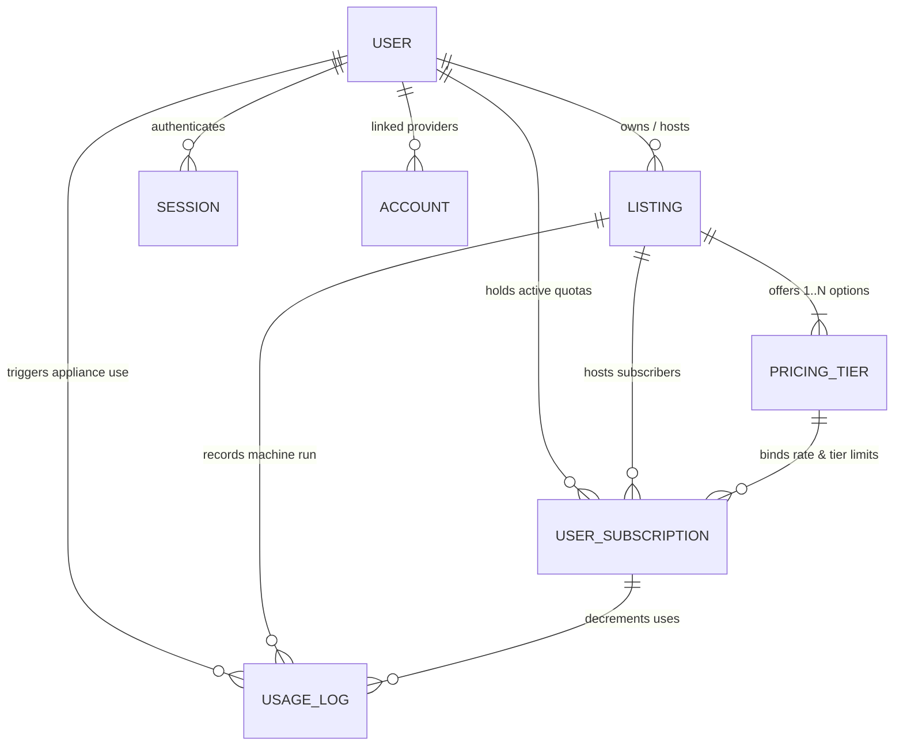

# System Architecture & Design Documentation
## P2P Community Rental & Fractional Usage Marketplace

### 1. Project Overview & Vision
The **Community P2P Rental & Fractional Sharing Marketplace** is a trust-first platform that enables neighborhood and community members to share high-value resources. It bridges three core asset classes:
1. **Time-Based Accommodation (Rooms & Spaces)**: Traditional nightly or weekly stays.
2. **Physical Items (Equipment, Tools & Gear)**: Daily or weekly rentals with security deposits.
3. **Fractional Appliance & Utility Subscriptions**: A shared-economy model where neighbors co-subscribe to high-ticket assets (e.g., a Bosch 9kg washing machine cluster capped at 4 members, granting 10 uses/month each; shared 3D printers, woodworking stations, or solar backup power).

---

### 2. Next.js 15 App Router Recommended Directory Structure

```
├── Design.md                          # Architecture blueprint and roadmap (Root)
├── db/
│   ├── index.ts                       # Neon Serverless PostgreSQL connection pool
│   ├── schema.ts                      # Complete Drizzle ORM schemas & relations
│   └── migrations/                    # Auto-generated Drizzle migration files
├── src/
│   ├── app/
│   │   ├── layout.tsx                 # Root layout with font definitions, auth provider, navbar & footer
│   │   ├── page.tsx                   # Main marketplace discovery page
│   │   ├── (auth)/
│   │   │   ├── sign-in/page.tsx       # Better Auth sign-in route
│   │   │   └── sign-up/page.tsx       # Better Auth registration route
│   │   ├── listings/
│   │   │   ├── page.tsx               # Filtered search & map discovery view
│   │   │   ├── [id]/page.tsx          # Listing detail, tier selection & live availability
│   │   │   └── new/page.tsx           # Multi-step host listing creation (Room/Item/Fractional)
│   │   ├── dashboard/
│   │   │   ├── subscriptions/page.tsx # Active fractional subscriptions & remaining use meters
│   │   │   ├── rentals/page.tsx       # Bookings & check-in QR codes
│   │   │   └── host/page.tsx          # Host management, subscriber slots & usage logs
│   │   └── api/
│   │       ├── auth/[...all]/route.ts # Better Auth API handlers
│   │       ├── subscriptions/use/     # Endpoint to log a fractional usage event
│   │       └── webhooks/stripe/       # Payment & subscription recurring billing webhooks
│   ├── actions/                       # Next.js 15 Server Actions (Typesafe mutations)
│   │   ├── listings.ts                # createListing, updateListing, archiveListing
│   │   ├── subscriptions.ts           # joinSubscription, cancelSubscription
│   │   └── usage.ts                   # recordFractionalUsage, getUsageAuditTrail
│   ├── components/
│   │   ├── ui/                        # Shadcn UI primitives (button, dialog, card, badge, progress)
│   │   ├── layout/                    # Navbar, Footer, CategoryFilterBar, MobileNav
│   │   ├── listings/                  # ListingCard, ListingGrid, PricingTierSelector, TierBadge
│   │   ├── usage/                     # UsageMeter, LogUsageModal, LiveSlotCounter, UsageHistoryList
│   │   └── host/                      # HostRevenueChart, SubscriberManager, ApplianceHealthStatus
│   ├── hooks/
│   │   ├── use-auth.ts                # Client session hook from Better Auth
│   │   ├── use-fractional-quota.ts    # Real-time calculation of remaining monthly uses
│   │   └── use-listing-filters.ts     # URL query state sync for categories & price tiers
│   ├── lib/
│   │   ├── auth.ts                    # Better Auth server instance & database adapter
│   │   ├── utils.ts                   # cn() styling helper & formatters (Currency, Date, Quotas)
│   │   └── constants.ts               # Categories, default quotas, period enums
│   └── types/
│       └── index.ts                   # Shared TypeScript interfaces & Drizzle inferred types
├── drizzle.config.ts                  # Drizzle ORM configuration for Neon PostgreSQL
└── package.json
```

---

### 3. Core Domain Models & Entity Relationships



1. **`User` / `Session` / `Account`**: Managed via Better Auth standard specification. Supports email/password, social OAuth (Google, GitHub), and community verification flags (ID verified, neighborhood vouches).
2. **`Listings`**: Root entity for all rentable assets. Categorized into `room`, `physical_item`, or `fractional_appliance`.
3. **`PricingTiers`**: Allows flexible multi-model pricing:
   - Time-based: Nightly (rooms), Daily / Hourly (tools/sports gear).
   - Fractional subscription: Monthly recurring price, usage limit per period (e.g. 10 uses/month), and max subscriber caps (e.g., strictly 4 co-users).
4. **`UserSubscriptions`**: State machine tracking user entitlement, renewal dates, and remaining monthly uses (`remainingUsesThisPeriod`).
5. **`UsageLogs`**: Tamper-evident ledger tracking every physical run of an appliance (timestamp, duration, operator, verification OTP/QR).

---

### 4. Fractional Appliance Mechanics & Immutable Audit Ledger
- **Capacity Constraint**: A washing machine or expensive tool cluster specifies `maxActiveSubscribers = 4`. The platform strictly prevents overselling.
- **Atomic Database Transactions (`db.transaction`)**: When a subscriber clicks "Log Use" or scans the machine QR code:
  1. System checks user authorization & verifies `remainingUsesThisPeriod > 0` and subscription is active.
  2. Decrements `remainingUsesThisPeriod` by 1 and increments `totalUsesUsed` by 1.
  3. Creates an immutable row in `UsageLogs`.
  4. Creates an immutable audit record in `SystemLogs` (`eventType: 'FRACTIONAL_USE_LOGGED'`) with rich JSONB metadata (actor, previous remaining uses, new remaining uses, units deducted, device code, and timestamp).
  5. If any validation or network call fails, the entire transaction is rolled back.
  6. On monthly billing cycle reset, `remainingUsesThisPeriod` replenishes to `usageLimitPerPeriod`.

- **Digital Handover State Machine (`actions/bookings.ts`)**:
  - Time-based rental bookings transition from `PENDING_HANDOVER` to `ACTIVE` upon physical token / QR code scan.
  - The `confirmHandover(bookingId, scannedCode)` Server Action verifies the token and creates a `SystemLogs` audit entry (`eventType: 'HANDOVER_COMPLETED'`) establishing the exact timestamp liability transfers to the renter.

- **Optimistic UI Execution (`useTransition`)**:
  - The client UI uses React 19 `useTransition` to decrement the remaining use meter from 10 to 9 instantly.
  - If the Server Action succeeds, server-verified records are merged. If the transaction throws or fails, local state gracefully reverts to the snapshot.

---

### 5. Multi-Phase Implementation Roadmap

- **Phase 1 (Completed)**:
  - Core Drizzle ORM schema with Better Auth compatibility and relations.
  - Responsive, sleek marketplace UI shell with navigation and dynamic filters.
  - Reusable, polymorphic `ListingCard` with time-based (e.g., `R450/night`) and fractional (e.g., `R500/mo · 10 uses`) styling.

- **Phase 2 (Completed - Core Backend & Immutable Ledger)**:
  - `SystemLogs` table with JSONB metadata and `system_event_type` enum (`BOOKING_CREATED`, `HANDOVER_COMPLETED`, `FRACTIONAL_USE_LOGGED`, `PAYMENT_HELD`, `LISTING_CREATED`).
  - Next.js 15 Server Action `logFractionalUse(subscriptionId, userId)` with atomic `db.transaction`.
  - Next.js 15 Server Action `confirmHandover(bookingId, scannedCode)` with digital handover state transition.
  - Optimistic UI integration with `useTransition` in `FractionalUsageLogger.tsx`.

- **Phase 3 (Completed - Discovery Engine & PostGIS Geospatial Search)**:
  - **Hierarchical Categories**: `categories` table with self-referencing `parent_id` foreign key. Parent category queries recursively resolve all child subcategories (e.g. *Vehicles* -> *Car Parts & Spares*, *Auto Diagnostics*).
  - **PostGIS Spatial Columns**: `listings.location` geometry point column `geometry(Point, 4326)` with GIST spatial index.
  - **Spatial Search Action (`actions/search.ts`)**: Implements `searchListings(params)` combining full-text search, hierarchical category expansion, and PostGIS `ST_DWithin` radius filtering with `ST_Distance` ascending proximity sorting.
  - **Privacy Shield Engine**: Approximate rounded distances (e.g., `< 500m away`, `~2.4 km away`) to protect host residential privacy until booking confirmation.
  - **URL-Based State Management**: Real-time synchronization of search terms, category pills, GPS coordinates, and radius with browser URL search parameters (`?category=...&sub=...&q=...&lat=...&lng=...&radius=...`).
  - **Discovery UI Suite**: Horizontally scrollable `CategoryNav` with subcategory drill-down, `SearchHeader` with HTML5 GPS geolocation & neighborhood presets, and `ProximityFeed` with distance badges.

- **Phase 4 (IoT & Access Verification)**:
  - Smart plug integration (Shelly / Tuya MQTT) for automated machine power-on upon usage log.
  - Digital lock PIN distribution for shared rooms and storage sheds.

- **Phase 5 (Community Trust & Dispute Management)**:
  - Neighbor vouching network and community security deposit escrow.
  - Machine maintenance pool funded by a 5% fraction of subscription revenue.
